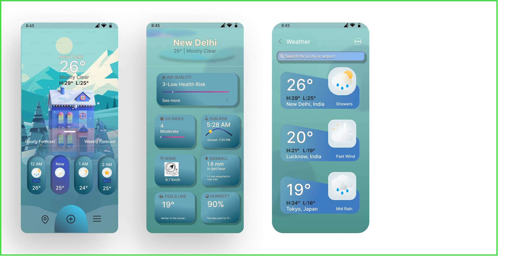

# Weather App UI       

This is a **Weather App UI prototype** designed in **Figma**, built with a clean and minimal approach. The project demonstrates how a weather application interface could look and feel, focusing on clarity and ease of use.

## Key Features

* Simple, user–friendly layout
* Weather cards showing temperature, conditions, and location
* Forecast screens for upcoming hours and days
* Custom icons and color choices to match weather states
* Designed primarily for mobile screens, adaptable to other devices

## Tools Used

* **Figma** – for wireframing, prototyping, and final design work

## What’s Inside

* **Prototype screens**: current weather, forecast, and location view
* **Components**: reusable cards, icons, and text styles
* **Style Guide**: included as a separate, multi–section page featuring:

  * A custom moodboard
  * Font colors and text styles
  * Tips for consistent design
  * All components used in the project

## How to Explore

1. Open the Figma link: [Weather App Prototype](https://www.figma.com/proto/AtIdzQ1hg5jsf4e3WOWbYk/Weather-App-UI?page-id=0%3A1&node-id=8-2&p=f&viewport=128%2C301%2C0.43&t=SNo69uPZjUJe57iA-1&scaling=scale-down-width&content-scaling=fixed)
2. Click through the screens to see the flow
3. Review the style guide page for moodboard, font details, and components
4. Duplicate the file in Figma to adapt it for your own use

## Next Steps

* Add support for dark mode
* Connect with a live weather API
* Expand layouts for tablets and desktops
